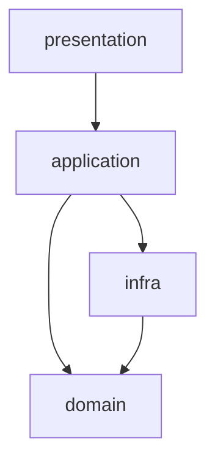

# 4つのモジュールの依存関係

対象モジュール:
- `presentation` (`src/fastapi01/presentation/router.py`)
- `application` (`src/fastapi01/application/service.py`)
- `infra` (`src/fastapi01/infra/repository.py`)
- `domain` (`src/fastapi01/domain/models.py`)

## 依存方向（import ベース）

- `presentation` -> `application`
- `application` -> `infra`
- `application` -> `domain`
- `infra` -> `domain`
- `domain` -> (依存なし: `pydantic` 標準利用のみ)

## 各モジュールの役割

- `presentation`
  - HTTP エンドポイントを定義する層。
  - `CountryService` を呼び出して API 入出力を担当する。

- `application`
  - ユースケースを表現する層。
  - `CountryRepository` を利用してデータ取得を行い、`Country` モデルを返す。

- `infra`
  - データアクセス層。
  - `data/countries.json` を読み込み、`Country` モデルへ変換する。

- `domain`
  - ドメインモデル層。
  - `Country`（`id`, `name_en`, `continent`, `capital`）を定義する。

## 補足

現在の実装では、依存は外側から内側に一方向になっている。
- `presentation` は `infra` を直接知らない。
- `infra` は `presentation` / `application` を知らない。
- `domain` は他モジュールに依存しない。
